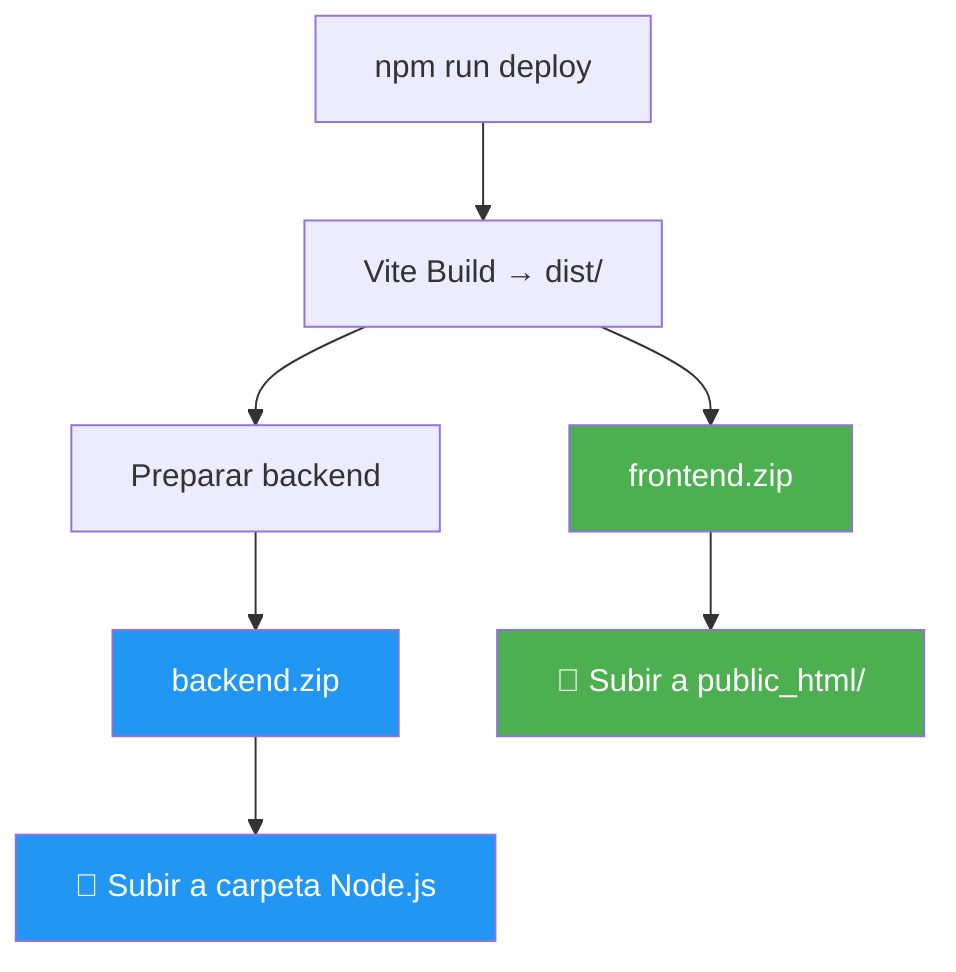
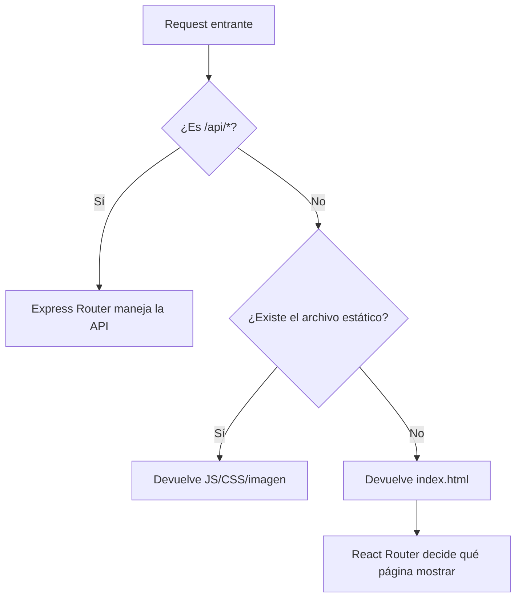
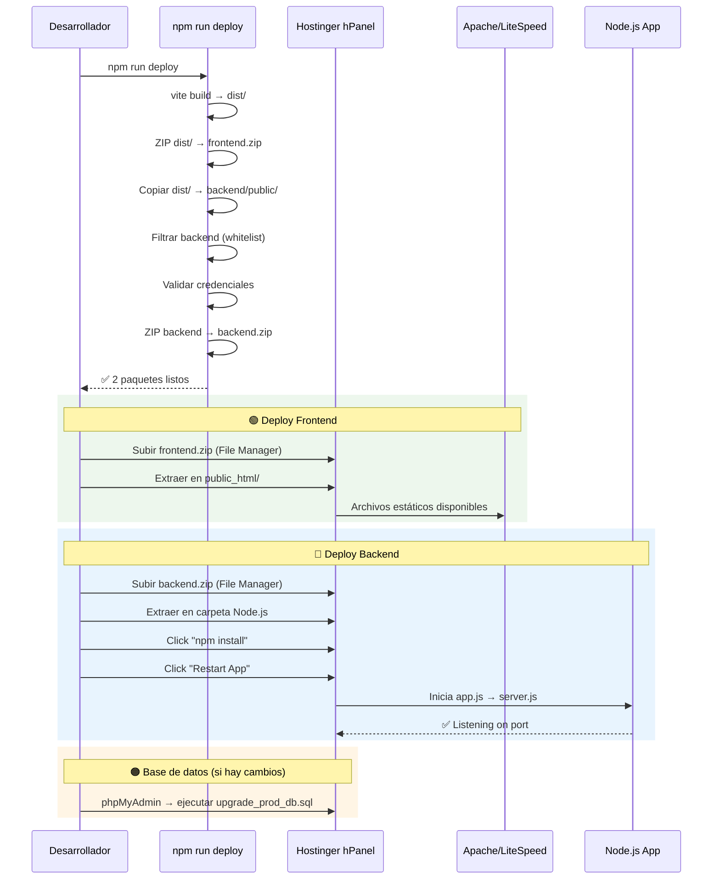

# 📦 Referencia Técnica: Sistema de Deploy Fotobook

> Documento de referencia para replicar este pipeline en otros proyectos Full-Stack (Frontend SPA + Backend Node.js) desplegados en hosting compartido (Hostinger, cPanel, etc.)

---

## 1. Contexto y Problema que Resuelve

### El Problema
En hosting compartido como Hostinger, no hay CI/CD (GitHub Actions, Vercel, etc.). El flujo de despliegue es manual:
1. Compilar el frontend localmente
2. Subir archivos por FTP o panel web
3. Reiniciar la aplicación Node.js desde el panel

Esto genera errores humanos: se olvidan archivos, se suben credenciales, se rompe la estructura. El script **automatiza todo excepto la subida**, produciendo un ZIP limpio listo para desplegar.

### La Solución Arquitectónica: "Deploy Dual" para Hostinger

Hostinger separa la infraestructura en **dos zonas distintas**:
- **`public_html/`** — Archivos estáticos servidos directamente por Apache/LiteSpeed (el web server de Hostinger)
- **Carpeta Node.js** (fuera de `public_html/`) — La aplicación Node.js/Express que maneja la API

El script genera **2 ZIPs separados**, cada uno destinado a una zona diferente:



| ZIP | Destino en Hostinger | Contenido | Servido por |
| :--- | :--- | :--- | :--- |
| `frontend.zip` | `public_html/` | HTML, CSS, JS compilado, assets | Apache/LiteSpeed (web server) |
| `backend.zip` | Carpeta Node.js (fuera de public) | Express, rutas API, config, credenciales | Node.js App (process manager) |

> [!IMPORTANT]
> **¿Por qué separados?** Hostinger ejecuta la app Node.js desde una carpeta privada fuera de `public_html/`. El frontend estático lo sirve Apache directamente (más rápido para archivos estáticos). La API se accede vía proxy inverso configurado automáticamente por Hostinger. El `backend.zip` también incluye una copia del frontend en `public/` como **fallback** — si Express necesita servir el SPA catch-all, tiene los archivos disponibles.

---

## 2. Archivos Involucrados

| Archivo | Rol en el Deploy |
| :--- | :--- |
| [package.json](file:///c:/workplasesVScode/fotobook/package.json) | Define el comando `npm run deploy` |
| [build-prod.cjs](file:///c:/workplasesVScode/fotobook/build-prod.cjs) | **Script principal de deploy** (146 líneas) |
| [vite.config.js](file:///c:/workplasesVScode/fotobook/vite.config.js) | Configuración del build de Vite |
| [server.js](file:///c:/workplasesVScode/fotobook/backend/server.js) | Servidor Express que sirve el frontend integrado |
| [app.js](file:///c:/workplasesVScode/fotobook/backend/app.js) | Entry point delegador (requerido por Hostinger) |
| [upgrade_prod_db.sql](file:///c:/workplasesVScode/fotobook/backend/scripts/upgrade_prod_db.sql) | Migraciones incrementales de BD |

---

## 3. Análisis Detallado del Script (`build-prod.cjs`)

### 3.1 ¿Por qué `.cjs` y no `.js`?

El proyecto usa `"type": "module"` en el `package.json` raíz, lo que hace que todos los `.js` se interpreten como ES Modules (`import/export`). Pero este script usa `require()` (CommonJS) porque:
- Es un script de sistema, no parte de la app
- `execSync`, `fs`, `path` son más cómodos en CommonJS
- La extensión `.cjs` fuerza la interpretación CommonJS independientemente del `"type"`

> [!IMPORTANT]
> Si tu proyecto usa `"type": "module"`, nombra tu script de deploy como `.cjs`. Si no, `.js` funciona igual.

---

### 3.2 Constantes de Configuración (Líneas 12-19)

```javascript
const { execSync } = require('child_process');
const fs   = require('fs');
const path = require('path');

const ROOT    = __dirname;          // Raíz del proyecto (donde está este script)
const DIST    = path.join(ROOT, 'dist');       // Salida de Vite
const BACKEND = path.join(ROOT, 'backend');    // Carpeta del backend
const OUT_DIR = path.join(ROOT, 'deploy_output'); // Carpeta de salida del deploy
```

**Para adaptar a otro proyecto:** Solo cambia `BACKEND` si tu carpeta de servidor tiene otro nombre (ej. `server/`, `api/`, `src/server/`).

---

### 3.3 Función `run(cmd, label)` — Ejecutor de Comandos (Líneas 23-27)

```javascript
function run(cmd, label) {
    console.log(`\n▶ ${label}...`);
    execSync(cmd, { stdio: 'inherit', cwd: ROOT });
    console.log(`✓ ${label} completado.`);
}
```

| Aspecto | Detalle |
| :--- | :--- |
| **`stdio: 'inherit'`** | Redirige stdout/stderr del proceso hijo a la terminal actual. Así ves la salida de Vite en tiempo real. |
| **`cwd: ROOT`** | Ejecuta siempre desde la raíz del proyecto, evitando problemas de paths relativos. |
| **Manejo de errores** | Si el comando falla (exit code ≠ 0), `execSync` lanza una excepción y el script se detiene. **Es intencional**: si el build falla, no quieres empaquetar basura. |

---

### 3.4 Función `ensureDir(dir)` — Creador Seguro de Directorios (Líneas 29-31)

```javascript
function ensureDir(dir) {
    if (!fs.existsSync(dir)) fs.mkdirSync(dir, { recursive: true });
}
```

- `recursive: true` crea toda la cadena de directorios si no existen
- Equivalente a `mkdir -p` en Linux
- Se usa para crear `deploy_output/` y `deploy_output/_backend_temp/public/`

---

### 3.5 Función `zipWithPowershell()` — Compresión Multi-Estrategia (Líneas 33-54)

```javascript
function zipWithPowershell(sourcePath, destZip) {
    const psCmd = `Compress-Archive -Path '${sourcePath}' -DestinationPath '${destZip}' -Force`;
    const candidates = [
        `powershell -Command "${psCmd}"`,                                              // PowerShell 5 (estándar)
        `"C:\\Windows\\System32\\WindowsPowerShell\\v1.0\\powershell.exe" -Command "${psCmd}"`, // Ruta absoluta
        `pwsh -Command "${psCmd}"`                                                     // PowerShell 7+ (Core)
    ];
    
    let lastError = null;
    for (const cmd of candidates) {
        try {
            execSync(cmd, { cwd: ROOT });
            return; // Éxito con el primer candidato que funcione
        } catch (e) {
            lastError = e;
        }
    }
    console.error(`\n❌ Error crítico al crear el ZIP: ${lastError.message}`);
    process.exit(1);
}
```

**¿Por qué 3 candidatos?** Porque dependiendo de la instalación de Windows:
- `powershell` puede no estar en el PATH
- La ruta absoluta puede variar
- En sistemas modernos puede haber solo `pwsh` (PowerShell Core)

El patrón **"try-fallback"** garantiza que funciona en cualquier PC Windows.

> [!TIP]
> **Para Linux/macOS**, reemplaza esta función con:
> ```javascript
> function zipWithNative(sourcePath, destZip) {
>     execSync(`cd "${path.dirname(sourcePath)}" && zip -r "${destZip}" .`, { cwd: ROOT });
> }
> ```

> [!WARNING]
> El flag `-Force` de `Compress-Archive` **sobreescribe** el ZIP si ya existe. Esto es intencional para que cada deploy genere un paquete fresco.

---

### 3.6 Función `copyRecursive()` — Copiado Selectivo (Líneas 56-69)

```javascript
function copyRecursive(src, dest, excluded) {
    if (!fs.existsSync(src)) return;           // Si no existe, ignora silenciosamente
    const stat = fs.statSync(src);
    if (stat.isDirectory()) {
        fs.mkdirSync(dest, { recursive: true });
        for (const file of fs.readdirSync(src)) {
            if (!excluded.has(file) && !file.endsWith('.log')) {  // Doble filtro
                copyRecursive(path.join(src, file), path.join(dest, file), excluded);
            }
        }
    } else {
        fs.copyFileSync(src, dest);
    }
}
```

| Mecanismo | Qué Filtra |
| :--- | :--- |
| `excluded.has(file)` | Nombres exactos: `node_modules`, `uploads`, `.env`, `Docs` |
| `!file.endsWith('.log')` | Cualquier archivo `.log` en cualquier nivel de profundidad |

**Diseño importante**: Esta función **no tiene dependencias externas**. No usa `archiver`, `glob`, ni ningún paquete npm. Esto es intencional — el script de deploy no debe fallar porque falta un `npm install`.

> [!NOTE]
> Se usa `fs.copyFileSync` (no streams) porque los archivos del backend son pequeños (KB). Para proyectos con assets grandes (videos, datasets), usar streams sería más eficiente.

---

### 3.7 Flujo Principal — Paso a Paso (Líneas 72-146)

#### Paso 1: Build del Frontend (Línea 78)

```javascript
run('npm run build', 'Compilando frontend (Vite)');
```

Esto ejecuta `vite build` que:
- Compila JSX/React a JavaScript estándar
- Minifica CSS y JS
- Genera hashes en nombres de archivos (cache-busting)
- Produce la carpeta `dist/` con `index.html` + assets

#### Paso 2: Preparar Carpeta de Salida (Línea 81)

```javascript
ensureDir(OUT_DIR);  // Crea deploy_output/ si no existe
```

#### Paso 3: ZIP del Frontend para `public_html/` (Líneas 84-88)

```javascript
const frontendZip = path.join(OUT_DIR, 'frontend.zip');
if (fs.existsSync(frontendZip)) fs.unlinkSync(frontendZip);  // Borra el anterior
zipWithPowershell(`${DIST}\\*`, frontendZip);
```

> [!IMPORTANT]
> **Este ZIP SÍ se usa en producción.** Se sube directamente a `public_html/` en Hostinger, donde Apache/LiteSpeed lo sirve como archivos estáticos. Esto es más eficiente que servir estáticos desde Node.js, ya que el web server nativo de Hostinger maneja caché, compresión gzip, y headers estáticos automáticamente.

#### Paso 4: Filtrado Selectivo del Backend (Líneas 91-128)

Esta es la parte más crítica. Define **exactamente qué va al paquete de producción**:

```javascript
// ❌ Lo que se EXCLUYE (nunca debe ir a producción)
const EXCLUDED = new Set([
    'node_modules',      // Se reinstala en el servidor con npm install
    'uploads',           // Datos de usuario - ya están en el servidor
    '.env',              // Secretos - ya configurados en el servidor
    'gemini_debug.log',  // Logs de desarrollo
    'Docs'               // Documentación interna
]);

// ✅ Lo que se INCLUYE (lista blanca explícita)
const INCLUDE_ONLY = [
    'app.js',            // Entry point (Hostinger lo busca por defecto)
    'server.js',         // Servidor Express real
    'package.json',      // Dependencias (para npm install en servidor)
    'package-lock.json', // Lock de versiones exactas
    'schema.sql',        // Esquema de BD (referencia, no se auto-ejecuta)
    'routes',            // Controladores de API
    'workers',           // Procesos background
    'config',            // Configuración + credenciales Firebase
    'scripts',           // Scripts de migración SQL
    'public',            // ← Aquí se inyecta el frontend compilado
    'middleware',         // Auth middleware, etc.
    'utils'              // Utilidades compartidas
];
```

> [!CAUTION]
> **La estrategia es WHITELIST, no BLACKLIST.** Esto significa que si agregas una nueva carpeta al backend (ej. `services/`), debes añadirla manualmente a `INCLUDE_ONLY` o no se desplegará. Esta es una decisión de seguridad: es preferible olvidar incluir algo (error visible) que incluir accidentalmente algo sensible (fuga silenciosa).

#### Paso 5: Integración Frontend → Backend (Líneas 104-110)

```javascript
const publicPath = path.join(BACKEND_TEMP, 'public');
ensureDir(publicPath);

// Copia TODO el contenido de dist/ dentro de public/
copyRecursive(DIST, publicPath, new Set());  // Sin exclusiones
```

Esto es lo que hace posible el "Backend Unificado":

```
deploy_output/_backend_temp/
├── app.js
├── server.js
├── package.json
├── routes/
├── config/
├── public/          ← 🔥 Aquí están los archivos del frontend
│   ├── index.html
│   ├── assets/
│   │   ├── index-abc123.js
│   │   └── index-def456.css
│   └── favicon.ico
└── ...
```

#### Paso 6: Validación de Credenciales (Líneas 117-125)

```javascript
if (item === 'config') {
    const firebaseJson = path.join(BACKEND, 'config', 'firebase-service-account.json');
    if (fs.existsSync(firebaseJson)) {
        console.log('✅ Certificado Firebase detectado y preparado para empaquetar.');
    } else {
        console.log('⚠️ ADVERTENCIA: No se encontró firebase-service-account.json');
    }
}
```

**¿Por qué solo advertencia y no error?** Porque el script no puede saber si la app requiere Firebase o no. Un `console.warn` notifica al desarrollador sin bloquear el deploy. En un proyecto donde Firebase es OBLIGATORIO, deberías cambiar esto a `process.exit(1)`.

#### Paso 7: Empaquetado Final + Limpieza (Líneas 130-136)

```javascript
const backendZip = path.join(OUT_DIR, 'backend.zip');
if (fs.existsSync(backendZip)) fs.unlinkSync(backendZip);
zipWithPowershell(`${BACKEND_TEMP}\\*`, backendZip);
fs.rmSync(BACKEND_TEMP, { recursive: true });  // Limpia la carpeta temporal
```

> [!IMPORTANT]
> `fs.rmSync` con `recursive: true` borra toda la carpeta temporal. Esto es seguro porque la carpeta está dentro de `deploy_output/`, nunca toca archivos del proyecto.

---

## 4. Cómo Funciona en el Servidor (server.js)

El deploy solo tiene sentido porque el servidor está preparado para recibir el frontend integrado:

```javascript
// 1. Servir archivos estáticos desde public/
app.use(express.static(path.join(__dirname, 'public')));

// 2. Las rutas API van primero (tienen prioridad)
app.use('/api/auth', require('./routes/auth'));
app.use('/api/products', require('./routes/products'));
// ... más rutas API ...

// 3. SPA Catch-all: TODO lo que no sea /api/* devuelve index.html
app.use((req, res) => {
    if (!req.path.startsWith('/api')) {
        const indexPath = path.join(__dirname, 'public', 'index.html');
        if (require('fs').existsSync(indexPath)) {
            return res.sendFile(indexPath);  // React Router maneja la ruta
        }
    }
    res.status(404).json({ success: false, message: 'Not Found' });
});
```



### ¿Por qué `app.js` delega a `server.js`?

```javascript
// app.js - Solo 1 línea útil
require('./server.js');
```

Hostinger busca `app.js` como entry point por defecto en su panel Node.js. En lugar de duplicar lógica, `app.js` simplemente carga `server.js`. Esto permite que en desarrollo uses `node server.js` directamente y en producción Hostinger encuentre su `app.js` esperado.

---

## 5. Relación con Vite Config (Desarrollo vs. Producción)

```javascript
// vite.config.js
export default defineConfig({
  server: {
    proxy: {
      '/api':     { target: 'http://localhost:5000', changeOrigin: true },
      '/uploads': { target: 'http://localhost:5000', changeOrigin: true }
    }
  }
})
```

| Entorno | ¿Quién sirve el frontend? | ¿Cómo llegan las llamadas a /api? |
| :--- | :--- | :--- |
| **Desarrollo** | Vite dev server (`:5173`) | Proxy de Vite redirige a Express (`:5000`) |
| **Producción** | Express desde `public/` (`:5000`) | Directa, mismo origen, sin proxy |

> [!TIP]
> Esta arquitectura elimina problemas de CORS en producción. En desarrollo, el proxy de Vite emula el mismo comportamiento.

---

## 6. Migraciones de Base de Datos (`upgrade_prod_db.sql`)

El script SQL complementario usa patrones "safe upgrade" que no destruyen datos existentes:

```sql
-- ✅ SEGURO: Agrega columnas solo si no existen
ALTER TABLE orders 
ADD COLUMN IF NOT EXISTS book_design LONGTEXT NULL AFTER selected_photos;

-- ✅ SEGURO: Upsert de catálogo (actualiza si ya existen, inserta si no)
INSERT INTO products (id, code, name, base_price, active) VALUES (...)
ON DUPLICATE KEY UPDATE 
  name = VALUES(name), 
  base_price = VALUES(base_price);

-- ✅ SEGURO: Crea tabla solo si no existe
CREATE TABLE IF NOT EXISTS jobs ( ... );
```

> [!WARNING]
> Este script se ejecuta **manualmente** vía phpMyAdmin después del deploy, NO automáticamente. Para automatizarlo necesitarías un script JS que se conecte a la BD de producción.

---

## 7. Resultado Final del Deploy

Después de ejecutar `npm run deploy`, la carpeta `deploy_output/` contiene **2 paquetes**:

```
deploy_output/
├── frontend.zip     🟢 Subir a → public_html/ (File Manager de Hostinger)
└── backend.zip      🔵 Subir a → Carpeta Node.js App (fuera de public_html)
```

### 📦 Contenido de `frontend.zip` (→ `public_html/`)
```
frontend.zip
├── index.html
├── favicon.ico
└── assets/
    ├── index-abc123.js     ← React app compilada y minificada
    └── index-def456.css    ← Estilos compilados
```

### 📦 Contenido de `backend.zip` (→ carpeta Node.js)
```
backend.zip
├── app.js                  ← Entry point (Hostinger lo busca por defecto)
├── server.js               ← Servidor Express real
├── package.json            ← Para npm install en servidor
├── package-lock.json
├── schema.sql
├── routes/
├── middleware/
├── utils/
├── workers/
├── config/
│   ├── db.js
│   ├── firebase.js
│   └── firebase-service-account.json
├── scripts/
│   └── upgrade_prod_db.sql
└── public/                 ← Copia del frontend (fallback SPA catch-all)
    ├── index.html
    └── assets/
```

> [!NOTE]
> El `backend.zip` también incluye el frontend en `public/` como **redundancia**. Esto permite que el SPA catch-all de Express (`res.sendFile('index.html')`) funcione correctamente para rutas como `/editor`, `/checkout`, etc. que no son archivos estáticos reales.

### Estructura en Hostinger después del deploy
```
Hostinger Server
├── public_html/              ← 🟢 Servido por Apache/LiteSpeed
│   ├── index.html
│   ├── assets/
│   └── .htaccess             ← Configurado por Hostinger
│
└── nodejs/                   ← 🔵 Carpeta privada Node.js App
    ├── app.js
    ├── server.js
    ├── node_modules/         ← Generado por npm install en hPanel
    ├── .env                  ← Configurado directamente en servidor
    ├── routes/
    ├── config/
    └── public/               ← Fallback del frontend
```

---

## 8. Template Adaptable para Otro Proyecto

```javascript
/**
 * deploy.cjs — Template de deploy para proyecto Full-Stack
 * Adapta las constantes y listas según tu estructura.
 * Uso: npm run deploy
 */
const { execSync } = require('child_process');
const fs = require('fs');
const path = require('path');

// ─── 🔧 CONFIGURA ESTAS CONSTANTES ──────────────────────────────
const ROOT = __dirname;
const FRONTEND_BUILD_CMD = 'npm run build';    // o 'npx vite build', 'npx next build'
const FRONTEND_DIST = path.join(ROOT, 'dist'); // o 'build', '.next/static', 'out'
const BACKEND_DIR = path.join(ROOT, 'backend'); // o 'server', 'api', 'src/server'
const OUTPUT_DIR = path.join(ROOT, 'deploy_output');

// ❌ Nunca empaquetar estos
const EXCLUDE = new Set([
    'node_modules', '.env', '.env.local', '.env.production',
    'uploads', '*.log', '__tests__', '.git'
]);

// ✅ Solo empaquetar estos (whitelist = más seguro)
const INCLUDE = [
    'app.js', 'server.js', 'index.js',     // Entry points (ajusta al tuyo)
    'package.json', 'package-lock.json',
    'routes', 'controllers', 'services',     // Lógica de negocio
    'middleware', 'utils', 'config',          // Infraestructura
    'public',                                 // ← Aquí va el frontend
    // Agrega tus carpetas aquí...
];

// ─── 🔐 Credenciales a verificar antes de empaquetar ─────────────
const REQUIRED_CREDENTIALS = [
    // { path: 'config/firebase-service-account.json', name: 'Firebase' },
    // { path: 'certs/ssl.pem', name: 'SSL Certificate' },
];

// ─── Helpers (No modificar) ──────────────────────────────────────

function run(cmd, label) {
    console.log(`\n▶ ${label}...`);
    execSync(cmd, { stdio: 'inherit', cwd: ROOT });
    console.log(`✓ ${label} completado.`);
}

function ensureDir(dir) {
    if (!fs.existsSync(dir)) fs.mkdirSync(dir, { recursive: true });
}

function copyRecursive(src, dest, excluded) {
    if (!fs.existsSync(src)) return;
    const stat = fs.statSync(src);
    if (stat.isDirectory()) {
        fs.mkdirSync(dest, { recursive: true });
        for (const file of fs.readdirSync(src)) {
            if (!excluded.has(file) && !file.endsWith('.log')) {
                copyRecursive(
                    path.join(src, file),
                    path.join(dest, file),
                    excluded
                );
            }
        }
    } else {
        fs.copyFileSync(src, dest);
    }
}

function createZip(sourcePath, destZip) {
    if (fs.existsSync(destZip)) fs.unlinkSync(destZip);
    
    // Windows: PowerShell
    if (process.platform === 'win32') {
        const psCmd = `Compress-Archive -Path '${sourcePath}' -DestinationPath '${destZip}' -Force`;
        const candidates = [
            `powershell -Command "${psCmd}"`,
            `pwsh -Command "${psCmd}"`
        ];
        for (const cmd of candidates) {
            try { execSync(cmd, { cwd: ROOT }); return; }
            catch { /* try next */ }
        }
    } else {
        // Linux/macOS: zip nativo
        const srcDir = path.dirname(sourcePath);
        execSync(`cd "${srcDir}" && zip -r "${destZip}" .`, { cwd: ROOT });
        return;
    }
    console.error('❌ No se pudo crear el ZIP');
    process.exit(1);
}

// ─── Main ────────────────────────────────────────────────────────

console.log('═══════════════════════════════════════════');
console.log('  Build & Package para Producción');
console.log('═══════════════════════════════════════════');

// 1. Build frontend
run(FRONTEND_BUILD_CMD, 'Compilando frontend');

// 2. Preparar salida
ensureDir(OUTPUT_DIR);

// 3. Preparar backend temporal
const TEMP = path.join(OUTPUT_DIR, '_temp');
if (fs.existsSync(TEMP)) fs.rmSync(TEMP, { recursive: true });
fs.mkdirSync(TEMP, { recursive: true });

// 4. Integrar frontend en backend/public
const publicDest = path.join(TEMP, 'public');
ensureDir(publicDest);
copyRecursive(FRONTEND_DIST, publicDest, new Set());
console.log('✓ Frontend integrado en backend/public');

// 5. Copiar archivos del backend
for (const item of INCLUDE) {
    if (item === 'public') continue;
    copyRecursive(
        path.join(BACKEND_DIR, item),
        path.join(TEMP, item),
        EXCLUDE
    );
}

// 6. Verificar credenciales
for (const cred of REQUIRED_CREDENTIALS) {
    const fullPath = path.join(BACKEND_DIR, cred.path);
    if (fs.existsSync(fullPath)) {
        console.log(`✅ ${cred.name} detectado`);
    } else {
        console.log(`⚠️ ADVERTENCIA: ${cred.name} no encontrado en ${cred.path}`);
    }
}

// 7. Empaquetar
const zipPath = path.join(OUTPUT_DIR, 'deploy.zip');
createZip(`${TEMP}${path.sep}*`, zipPath);
fs.rmSync(TEMP, { recursive: true });
console.log('✓ deploy.zip creado');

// 8. Resumen
console.log('\n═══════════════════════════════════════════');
console.log('  ✅ Paquete listo en deploy_output/');
console.log('  📦 deploy.zip → subir al servidor');
console.log('  ⚡ Ejecutar: npm install en el servidor');
console.log('═══════════════════════════════════════════\n');
```

### Configurar en `package.json`:
```json
{
  "scripts": {
    "deploy": "node deploy.cjs"
  }
}
```

### Configurar en `server.js` del otro proyecto:
```javascript
// Servir frontend desde public/
app.use(express.static(path.join(__dirname, 'public')));

// API routes PRIMERO
app.use('/api', apiRouter);

// SPA catch-all DESPUÉS
app.use((req, res) => {
    if (!req.path.startsWith('/api')) {
        return res.sendFile(path.join(__dirname, 'public', 'index.html'));
    }
    res.status(404).json({ error: 'Not Found' });
});
```

---

## 9. Flujo Completo de Deploy (Manual Post-Script)


